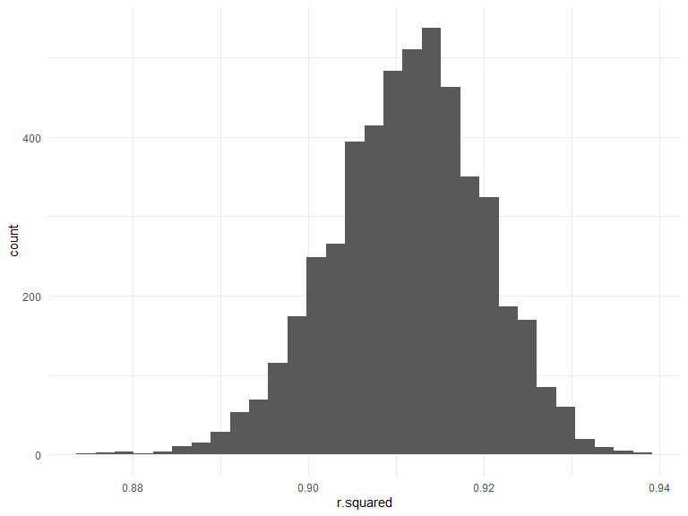

p8105\_hw6\_jsg2145
================
Jared Garfinkel
11/19/2019

``` r
birthweight <- read_csv("./birthweight.csv") %>% 
  janitor::clean_names() %>% 
  mutate(babysex = as.factor(babysex),
         frace = as.factor(frace),
         mrace = as.factor(mrace),
         malform = as.factor(malform),
         )
```

    ## Parsed with column specification:
    ## cols(
    ##   .default = col_double()
    ## )

    ## See spec(...) for full column specifications.

``` r
birthweight %>% 
  ggplot(aes(x = bwt)) +
  geom_histogram()
```

    ## `stat_bin()` using `bins = 30`. Pick better value with `binwidth`.


``` r
fit <- lm(bwt ~ ., data = birthweight)
```

``` r
alias(fit)
```

``` r
fit1 <- lm(bwt ~ . -pnumlbw -pnumsga -wtgain, data = birthweight)
```

``` r
car::vif(fit1)
```

``` r
fit2 <-lm(bwt ~ . -pnumlbw -pnumsga -wtgain -frace -ppwt -mheight, data = birthweight)
```

``` r
car::vif(fit2)
```

``` r
selectedmodel <- step(fit2)
```

``` r
summary(selectedmodel)
```

    ## 
    ## Call:
    ## lm(formula = bwt ~ babysex + bhead + blength + delwt + fincome + 
    ##     gaweeks + mrace + parity + ppbmi + smoken, data = birthweight)
    ## 
    ## Residuals:
    ##      Min       1Q   Median       3Q      Max 
    ## -1102.35  -185.00    -4.75   174.79  2345.85 
    ## 
    ## Coefficients:
    ##               Estimate Std. Error t value Pr(>|t|)    
    ## (Intercept) -5681.3898   101.3628 -56.050  < 2e-16 ***
    ## babysex2       28.0178     8.4536   3.314 0.000926 ***
    ## bhead         131.0397     3.4463  38.023  < 2e-16 ***
    ## blength        74.9196     2.0193  37.102  < 2e-16 ***
    ## delwt           3.6006     0.2844  12.662  < 2e-16 ***
    ## fincome         0.2953     0.1741   1.696 0.090010 .  
    ## gaweeks        11.7635     1.4593   8.061 9.72e-16 ***
    ## mrace2       -138.2267     9.9059 -13.954  < 2e-16 ***
    ## mrace3        -74.4089    42.3169  -1.758 0.078754 .  
    ## mrace4        -96.9257    19.1235  -5.068 4.18e-07 ***
    ## parity         97.4929    40.3422   2.417 0.015705 *  
    ## ppbmi         -12.4642     1.9164  -6.504 8.70e-11 ***
    ## smoken         -4.8518     0.5858  -8.282  < 2e-16 ***
    ## ---
    ## Signif. codes:  0 '***' 0.001 '**' 0.01 '*' 0.05 '.' 0.1 ' ' 1
    ## 
    ## Residual standard error: 272.4 on 4329 degrees of freedom
    ## Multiple R-squared:  0.7178, Adjusted R-squared:  0.717 
    ## F-statistic: 917.7 on 12 and 4329 DF,  p-value: < 2.2e-16

I looked at spread of the birthweight variable and used a skim function
to view the spread of other

variables. Then I created a model using all the available variables and
tested for aliased variables

or variables that did not include additional information in the
dataframe and removed them.

Then I checked for variance inflation factors.

I removed selected terms with VIFs greater than 10 until there were no
VIFs greater than 10.

Then I ran the remaining variables through stepwise regression and
selected the final model with the

lowest AIC.

``` r
set.seed(1)

cross_df <- crossv_mc(birthweight, 100)
```

``` r
cross_df <- cross_df %>% 
  mutate(
    train = map(train, as_tibble),
    test = map(test, as_tibble))
```

``` r
cross_results <- cross_df %>% 
  mutate(linear_1  = map(train, ~lm(bwt ~ blength + gaweeks, data = .x)),
         linear_mod_s = map(train, ~lm(bwt ~ babysex + bhead + blength + delwt + fincome + 
    gaweeks + mrace + parity + ppbmi + smoken, data = .x)),
         linear_2 = map(train, ~lm(bwt ~ bhead + blength + babysex + bhead * blength * babysex + bhead * blength + bhead * babysex + blength * babysex, data = .x)),
         rmse_linear_1 = map2_dbl(.x = linear_1, .y = test, ~rmse(.x, .y)),
         rmse_linear_s = map2_dbl(.x = linear_mod_s, .y = test, ~rmse(.x, .y)),
         rmse_linear_2 = map2_dbl(.x = linear_2, .y = test, ~rmse(.x, .y)))
```

``` r
cross_results %>% 
  select(starts_with("rmse")) %>% 
  pivot_longer(
    everything(),
    names_to = "model", 
    values_to = "rmse",
    names_prefix = "rmse_") %>% 
  mutate(model = fct_inorder(model)) %>% 
  ggplot(aes(x = model, y = rmse)) + 
  geom_violin()
```


Compared to two other models, my model had a lower RMSE. However, when
looking for an “optimal”

model, it may be appropriate to choose a parsimonious model rather than
a more complex model.

``` r
birthweight <- birthweight %>% 
  add_predictions(selectedmodel) %>% 
  add_residuals(selectedmodel)
```

``` r
birthweight %>%
  ggplot(aes(x=pred, y=resid)) + 
  geom_point()
```


## Problem 2

``` r
weather_df = 
  rnoaa::meteo_pull_monitors(
    c("USW00094728"),
    var = c("PRCP", "TMIN", "TMAX"), 
    date_min = "2017-01-01",
    date_max = "2017-12-31") %>%
  mutate(
    name = recode(id, USW00094728 = "CentralPark_NY"),
    tmin = tmin / 10,
    tmax = tmax / 10) %>%
  select(name, id, everything())
```

    ## Registered S3 method overwritten by 'crul':
    ##   method                 from
    ##   as.character.form_file httr

    ## Registered S3 method overwritten by 'hoardr':
    ##   method           from
    ##   print.cache_info httr

    ## file path:          C:\Users\jared\AppData\Local\rnoaa\rnoaa\Cache/ghcnd/USW00094728.dly

    ## file last updated:  2019-09-26 10:45:54

    ## file min/max dates: 1869-01-01 / 2019-09-30

``` r
set.seed(1)

boot_df <- weather_df %>% 
  bootstrap(n = 5000) %>% 
  mutate(
    models = map(strap, ~lm(tmax ~ tmin, data = .x) ),
    results = map(models, broom::glance),
    tidyresults = map(models, broom::tidy))
```

``` r
boot_df %>% 
  select(-strap, -models) %>% 
  unnest(results) %>% 
  ggplot(aes(x = r.squared)) +
  geom_histogram()
```

    ## `stat_bin()` using `bins = 30`. Pick better value with `binwidth`.



The 95% confidence interval of the r-squared estimates is (0.89, 0.93).

``` r
boot_df %>% 
  select(-strap, -models) %>% 
  unnest(tidyresults) %>% 
  select(.id, term, estimate) %>% 
  pivot_wider(names_from = term,
              values_from = estimate) %>% 
  janitor::clean_names() %>% 
  mutate(logpred = log(intercept*tmin)) %>% 
  ggplot(aes(x = logpred)) +
  geom_histogram()
```

    ## `stat_bin()` using `bins = 30`. Pick better value with `binwidth`.


The 95% confidence interval of the log of the product of
\(\hat{\beta_0}\) and \(\hat{\beta_1}\) is (1.96, 2.06)

The distribution of the r-squared and logs of the products are fairly
normal, as would be expected

from a large sample size, since our sample data was bootstrapped 5000
times.
